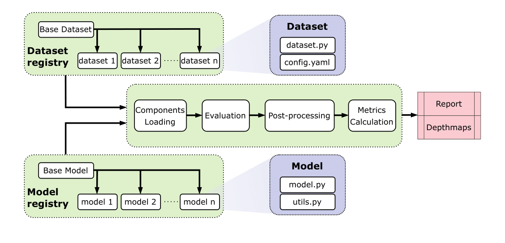

# MonoDeMB

This repository provides source code for "MonoDeMB: Comprehensive Monocular DepthMap Benchmark" paper



## Benchmark Results

Below are the benchmark results comparing different monocular depth estimation models across various datasets:

| Model | Test dataset | RMSE↓ | AbsRel↓ | silog↓ | δ₁↑ | δ₂↑ | δ₃↑ |
|-------|--------------|-------|---------|--------|-----|-----|-----|
| **LeReS** | NYUv2 labeled | 0.2778 | 0.0762 | 0.0455 | 0.9395 | 0.9867 | 0.9968 |
| | KITTI | 4.0954 | 0.1457 | 0.1270 | 0.7910 | 0.9566 | 0.9847 |
| | DIODE | 4.1154 | 0.3371 | 0.1425 | 0.7223 | 0.8641 | 0.9180 |
| | ETH3D | 1.0302 | 0.1184 | 0.1073 | 0.8683 | 0.9685 | 0.9857 |
| | Synth2 (100) | **0.1135** | 0.1656 | 0.0986 | 0.8148 | 0.9124 | 0.9675 |
| | Synth2v2 (300) | **0.1131** | 0.1766 | 0.1059 | 0.8002 | 0.8947 | 0.9627 |
| **MiDaS** | NYUv2 labeled | 0.4242 | 0.1301 | 0.1179 | 0.8449 | 0.9568 | 0.9804 |
| | KITTI | 6.8630 | 0.3167 | 0.8965 | 0.4510 | 0.7951 | 0.8861 |
| | DIODE | 4.2977 | 0.3710 | 0.1722 | 0.6701 | 0.8202 | 0.8896 |
| | ETH3D | 1.3399 | 0.1672 | 0.3969 | 0.7811 | 0.9256 | 0.9582 |
| | Synth2 (100) | 0.1484 | 0.2370 | 0.1163 | 0.6144 | 0.9120 | 0.9647 |
| | Synth2v2 (300) | 0.1479 | 0.2403 | 0.1145 | 0.5741 | 0.9225 | 0.9790 |
| **Depth Anything** | NYUv2 labeled | 0.3801 | 0.1174 | 0.1467 | 0.8724 | 0.9604 | 0.9780 |
| | KITTI | 6.7533 | 0.3087 | 0.9074 | 0.4657 | 0.8015 | 0.8901 |
| | DIODE | 4.3522 | 0.3806 | 0.1711 | 0.6776 | 0.8221 | 0.8895 |
| | ETH3D | 1.3034 | 0.1616 | 0.4441 | 0.7823 | 0.9269 | 0.9566 |
| | Synth2 (100) | 0.1499 | 0.2439 | 0.1181 | 0.5854 | 0.9120 | 0.9675 |
| | Synth2v2 (300) | 0.1504 | 0.2493 | 0.1171 | 0.5224 | 0.9248 | 0.9805 |
| **Metric3D v2** | NYUv2 labeled | 0.3981 | 0.0403 | 0.0281 | 0.9827 | 0.9959 | 0.9984 |
| | KITTI | 2.2151 | 0.0517 | 0.0336 | 0.9789 | 0.9959 | 0.9987 |
| | DIODE | 2.4554 | 0.1465 | 0.0837 | 0.8917 | 0.9543 | 0.9755 |
| | ETH3D | 0.3981 | 0.0403 | 0.0281 | 0.9827 | 0.9959 | 0.9984 |
| | Synth2 (100) | 0.1410 | 0.2271 | 0.3683 | 0.8064 | 0.8722 | 0.9122 |
| | Synth2v2 (300) | 0.1464 | 0.2495 | 0.3124 | 0.7794 | 0.8584 | 0.9008 |
| **UniDepth** | NYUv2 labeled | 0.1259 | **0.0264** | **0.0191** | **0.9925** | **0.9986** | **0.9996** |
| | KITTI | 1.8165 | 0.0424 | 0.0280 | 0.9870 | 0.9978 | 0.9994 |
| | DIODE | 3.3409 | 0.2414 | 0.1120 | 0.8189 | 0.9129 | 0.9491 |
| | ETH3D | 0.3706 | 0.0362 | 0.0267 | 0.9836 | 0.9970 | 0.9989 |
| | Synth2 (100) | 0.1320 | 0.2065 | 0.3295 | 0.8278 | 0.8876 | 0.9214 |
| | Synth2v2 (300) | 0.1328 | 0.2191 | 0.2519 | 0.8058 | 0.8793 | 0.9159 |
| **GenPercept** | NYUv2 labeled | 0.2165 | 0.0533 | 0.0342 | 0.9656 | 0.9921 | 0.9979 |
| | KITTI | 4.2525 | 0.1284 | 0.2147 | 0.8439 | 0.9710 | 0.9907 |
| | DIODE | 3.6241 | 0.3013 | 0.1274 | 0.7674 | 0.8919 | 0.9376 |
| | ETH3D | 0.5641 | 0.0618 | 0.0393 | 0.9602 | 0.9895 | 0.9956 |
| | Synth2 (100) | 0.1217 | 0.2092 | 0.2003 | 0.7343 | 0.8407 | 0.9229 |
| | Synth2v2 (300) | 0.1233 | 0.2281 | 0.2102 | 0.7029 | 0.8156 | 0.9111 |
| **GeoWizard** | NYUv2 labeled | 0.2269 | 0.0590 | 0.0370 | 0.9599 | 0.9907 | 0.9976 |
| | KITTI | 4.5004 | 0.1447 | 0.0798 | 0.8182 | 0.9678 | 0.9917 |
| | DIODE | 4.0331 | 0.3201 | 0.1233 | 0.7630 | 0.8890 | 0.9385 |
| | ETH3D | 0.7818 | 0.0769 | 0.0425 | 0.9411 | 0.9860 | 0.9949 |
| | Synth2 (100) | 0.1320 | 0.1939 | 0.1909 | 0.8477 | 0.8978 | 0.9243 |
| | Synth2v2 (300) | 0.1420 | 0.2239 | 0.1775 | 0.8282 | 0.8836 | 0.9098 |
| **Marigold** | NYUv2 labeled | 0.2237 | 0.0567 | 0.0359 | 0.9629 | 0.9917 | 0.9978 |
| | KITTI | 4.1591 | 0.1220 | 0.0882 | 0.8559 | 0.9694 | 0.9898 |
| | DIODE | 3.7014 | 0.3011 | 0.1252 | 0.7754 | 0.8916 | 0.9398 |
| | ETH3D | 0.5617 | 0.0593 | 0.0406 | 0.9638 | 0.9909 | 0.9954 |
| | Synth2 (100) | 0.1190 | 0.2027 | 0.3279 | 0.7424 | 0.8459 | 0.9276 |
| | Synth2v2 (300) | 0.1218 | 0.2246 | 0.3396 | 0.7096 | 0.8187 | 0.9139 |

*Note: Best results are in **bold**. Lower is better for RMSE, AbsRel, and silog metrics (↓). Higher is better for δ₁, δ₂, and δ₃ metrics (↑).*


## Project Structure

```
.
├── src/
│   ├── datasets/                    # Dataset implementations
│   │   ├── base_dataset.py          # Base dataset class
│   │   ├── nyu/                     # NYU Depth V2 dataset
│   │   ├── kitti/                   # KITTI dataset
│   │   ├── diode/                   # DIODE dataset
│   │   └── eth3d/                   # ETH3D dataset
│   │
│   ├── models/                      # Model implementations
│   │   ├── base_model.py           # Base model class
│   │   ├── midas/                  # MiDaS model wrapper
│   │   ├── leres_wrapper/          # LeReS model wrapper
│   │   ├── depth_anything_wrapper/ # DepthAnything wrapper
│   │   ├── genpercept_wrapper/     # GenPercept wrapper
│   │   ├── metric3dv2_wrapper/     # Metric3Dv2 wrapper
│   │   ├── unidepth_wrapper/       # UniDepth wrapper
│   │   ├── marigold_wrapper/       # Marigold wrapper
│   │   └── geowizard_wrapper/      # GeoWizard wrapper
│   │
│   └── metrics/                     # Evaluation metrics
│       ├── base_metric.py          # Base metric class
│       ├── abs_rel.py              # Absolute relative error
│       ├── rmse.py                 # Root mean square error
│       ├── silog.py                # Scale invariant logarithmic error
│       └── threshold_metrics.py    # Delta threshold metrics
│
├── tests/                          # Unit tests
├── run_eval.py                     # Main evaluation script
├── DATASETS.md                     # Detailed dataset documentation
└── README.md                       # This file
```

## Quick Links
- For detailed guidance on extending the framework, see the sections below
- For detailed dataset information, look at [datasets.md](datasets.md)

# Extending the Framework

This guide explains how to extend the framework with custom models, datasets, and metrics.

## Adding a Custom Dataset

1. Create a new directory in `src/datasets/your_dataset/`:
```
src/datasets/your_dataset/
├── __init__.py           # Export your dataset class
├── dataset.py            # Dataset implementation
└── your_dataset.yaml     # Dataset configuration
```

2. Create dataset class:
```python
# dataset.py
from ..base_dataset import BaseDataset, register_dataset

@register_dataset('your_dataset_name')
class YourDataset(BaseDataset):
    """Your dataset implementation."""
    
    def __init__(self, config_path: str, split: str = 'test', batch_size: int = 1):
        """Initialize dataset.
        
        Args:
            config_path: Path to dataset config file
            split: Dataset split (train/val/test)
            batch_size: Batch size for loading data
        """
        super().__init__(config_path, split, batch_size)
    
    def _traverse_directory(self) -> List[Dict[str, str]]:
        """Get paths to RGB-depth pairs.
        
        Returns:
            List of dicts containing paths for image and depth pairs
        """
        data_pairs = []
        # Implement your directory traversal logic:
        # 1. Get all RGB and depth paths
        # 2. Match pairs based on naming/structure
        # 3. Validate pairs exist
        return data_pairs
        
    def _load_depth(self, path: str) -> np.ndarray:
        """Load depth map from file.
        
        Args:
            path: Path to depth map file
            
        Returns:
            Depth map as numpy array [H, W]
        """
        # Implement depth loading with proper normalization
        return depth
```

3. Create configuration file:
```yaml
# your_dataset.yaml
name: 'Your Dataset'
description: 'Description of your dataset'

paths:
  root_dir: '/path/to/data'
  train: 'train'
  val: 'val'  
  test: 'test'

preprocessing:
  rgb_mean: [0.485, 0.456, 0.406]
  rgb_std: [0.229, 0.224, 0.225]
  target_size: [480, 640]  # [height, width]
  depth_scale: 1000.0  # If depths are in mm
  max_depth: 10.0     # Maximum depth in meters
```

4. Update `src/datasets/__init__.py`:
```python
from .your_dataset import YourDataset

__all__ = [
    # existing datasets
    'YourDataset',
]
```

There is an example of simple custom dataset - please, check out the [mock source code](src/datasets/mock_dataset).

## Adding a Custom Model

1. Create a new directory in `src/models/your_model_wrapper/`:
```
src/models/your_model_wrapper/
├── __init__.py          # Export your model and utilities
├── model.py             # Model wrapper implementation
└── utils.py             # Model-specific utilities
```

2. Create model wrapper:
```python
# model.py
import torch
from ...base_model import BaseModel

class YourModelWrapper(BaseModel):
    """Wrapper for your model."""
    
    def __init__(self, model_type: str = "default"):
        """Initialize model.
        
        Args:
            model_type: Type/variant of the model
        """
        super().__init__(model_name=f"your_model_{model_type}")
        self.model = # Initialize your model
        
    def to(self, device):
        """Move model to device."""
        self.model = self.model.to(device)
        return self
        
    def preprocess(self, rgb):
        """Preprocess input for model.
        
        Args:
            rgb: RGB input in any format (tensor CHW or HWC, numpy HWC)
            
        Returns:
            torch.Tensor: Preprocessed input in model format
        """
        # Handle different input formats
        # Normalize if needed
        return processed_rgb
        
    def forward(self, img):
        """Run inference.
        
        Args:
            img: RGB image in any format (tensor/numpy, CHW/HWC)
            
        Returns:
            torch.Tensor: Predicted depth map normalized to [0,1]
        """
        # 1. Preprocess input
        img = self.preprocess(img)
        
        # 2. Run inference
        depth = self.model(img)
        
        # 3. Normalize output to [0,1]
        depth = (depth - depth.min()) / (depth.max() - depth.min())
        
        return depth
```

3. Create utilities:
```python
# utils.py
import numpy as np
import cv2
from PIL import Image

def process_image(image_path: str) -> np.ndarray:
    """Read and preprocess image.
    
    Args:
        image_path: Path to input image
        
    Returns:
        np.ndarray: Preprocessed image in RGB format and range [0,1]
    """
    # 1. Load image
    # 2. Convert to RGB if needed
    # 3. Normalize to [0,1]
    return img

def colorize(depth: np.ndarray, **kwargs) -> np.ndarray:
    """Colorize depth map.
    
    Args:
        depth: Depth map in range [0,1]
        
    Returns:
        np.ndarray: Colored depth map
    """
    return colored_depth
```

4. Update model registry in `src/models/__init__.py`:
```python
MODEL_REGISTRY = {
    # ... existing models ...
    'your_model': {
        'module': 'src.models.your_model_wrapper',
        'class': 'YourModelWrapper',
        'variants': ['variant1', 'variant2']  # Your model variants
    }
}
```

## Adding a Custom Metric

1. Create a new metric in `src/metrics/your_metric.py`:
```python
from .base_metric import BaseMetric, register_metric
import torch

@register_metric('your_metric')
class YourMetric(BaseMetric):
    """Your custom metric."""
    
    def compute(self, pred: torch.Tensor, target: torch.Tensor, 
                mask: torch.Tensor) -> float:
        """Compute metric value.
        
        Args:
            pred: Predicted depth [B, 1, H, W]
            target: Ground truth depth [B, 1, H, W] 
            mask: Valid pixels mask [B, 1, H, W]
            
        Returns:
            float: Computed metric value
        """
        # 1. Apply mask
        # 2. Compute metric
        # 3. Handle edge cases
        return value
```

2. Update `src/metrics/__init__.py`:
```python
from .your_metric import YourMetric

__all__ = [
    # existing metrics
    'YourMetric'
]
```

## Testing Your Datasets

To examine dataset and check its statistics

```bash
# Test loading and statistics
python examine_dataset.py --dataset your_dataset --make-report
```

To test datasets building and functionality:

```bash
# Test integration
pytest -v tests/test_datasets.py
```

## Model Running Inference

Models are run using a wrapper script that handles virtual environment activation. Each model or group of models requires its specific environment from the `virt_envs/` directory.

### Basic Usage
```bash
# Using default environment
bash run_benchmark.sh

# Specify environment and model
bash run_benchmark.sh your_model --models metric3dv2 --variants vit_large

# Different environment with additional parameters
bash run_benchmark.sh leres --models leres --variants resnext101 --save-depth-maps
```

### Virtual Environments
Models are expected to have their environments in the `virt_envs/` directory:
```
virt_envs/
├── leres/                # For LeReS models
├── depth_anything/       # For Depth Anything models
└── ...
```

### Command Structure
```bash
bash run_benchmark.sh [venv_name] [script_arguments...]
```
- `venv_name`: Virtual environment name from virt_envs
- `script_arguments`: Any additional arguments passed to run_eval.py

### Examples
```bash
# Run with visualization output
bash run_benchmark.sh your_env --save-visualizations --num-vis-samples 10

# Use CPU device
bash run_benchmark.sh leres --device cpu --batch-size 4

# Help information
bash run_benchmark.sh --help
```

### Virtual Environment Organization

For each model virtual environment can be created via:

```bash
python -m venv env_name
```

So env is stored in `virt_envs/` dir.

## Software Requirements Examples

> **IMPORTANT**: The codebase has been tested with the following configuration:
- CUDA Version: 11.5

So for your personal setup the other verions of libraries like PyTorch may be required. 

Following requirements were created from original repositories instructions


### UniDepth + (LeRes, MiDas, DepthAnything, GenPercept)

```bash
python -m venv virt_envs/torch_models
source virt_envs/torch_models/bin/activate

git clone https://github.com/lpiccinelli-eth/UniDepth
pip install torch torchvision torchaudio
pip install -e .
pip install xformers==0.0.24
pip install imutils==0.5.4

pip install timm==0.9.5

pip install omegaconf==2.3.0
pip install diffusers==0.32.1
pip install transformers==4.47.1
pip install peft==0.14.0
```

This env can be reused for `leres`, `genpercept`, `midas`, `depth_anything` models.

## Command Line Arguments

### Dataset Arguments
- `--dataset-config` (str, default: 'src/datasets/nyu/nyu.yaml')
  - Path to dataset configuration file
  - Example: `--dataset-config src/datasets/nyu/nyu.yaml`

- `--batch-size` (int, default: 1)
  - Batch size for testing
  - Example: `--batch-size 4`

- `--split` (str, default: 'test')
  - Dataset split to test on
  - Values: 'train', 'val', 'test'
  - Example: `--split test`

### Model Arguments
- `--models` (list of str, default: ['leres'])
  - List of models to test
  - Example: `--models depth_anything leres`

- `--variants` (list of str)
  - Model variants for each specified model
  - Must match number of models
  - Variants per model:
    - leres: ['resnet50', 'resnext101']
    - depth_anything: ['vitb', 'vitl', 'vits']
  - Example: `--variants vitl resnet50`

- `--device` (str, default: 'cuda')
  - Device to run evaluation on
  - Values: 'cuda', 'cpu'
  - Example: `--device cuda`

### Output Arguments
- `--output-dir` (str, default: 'benchmark_results')
  - Directory to save results
  - Example: `--output-dir results/nyu_test`

- `--save-visualizations` (flag)
  - Save sample visualizations with error maps
  - Example: `--save-visualizations`

- `--save-depth-maps` (flag)
  - Save all raw depth maps paired with input images
  - Creates separate directories for RGB and depth maps
  - Example: `--save-depth-maps`

- `--num-vis-samples` (int, default: 5)
  - Number of visualization samples to save
  - Only used if --save-visualizations is set
  - Example: `--num-vis-samples 10`

## Output Structure
```
benchmark_results/
├── model_name_variant/
│   ├── depth_pairs/
│   │   ├── rgb/
│   │   │   ├── image_0001.png
│   │   │   └── ...
│   │   └── depth/
│   │       ├── image_0001.png
│   │       └── ...
│   └── visualizations/
│       ├── sample_0.png
│       └── ...
├── results.json
└── benchmark_YYYYMMDD_HHMMSS.log
```

# Environment Setup

## Isolated Environments

Currently, it's recommended to use isolated virtual environments for specific models or model groups, especially when some models share code bases or have similar requirements.

### Why Isolated Environments?

1. Different models may require different versions of the same dependencies
2. Some models share code bases and require specific framework versions
3. Prevents dependency conflicts between different models
4. Makes troubleshooting easier

## Model-Specific Requirements

For detailed requirements, refer to the original model repositories:

- **LeReS**: [Original Repository](https://github.com/aim-uofa/AdelaiDepth)
- **Depth Anything**: [Original Repository](https://github.com/LiheYoung/Depth-Anything)
- **MiDaS**: [Original Repository](https://github.com/isl-org/MiDaS)
- **Metric3D**: [Original Repository](https://github.com/yvanyin/metric3d)
- **UniDepth**: [Original Repository](https://github.com/lpiccinelli-eth/UniDepth)
- **Marigold**: [Original Repository](https://github.com/prs-eth/Marigold)
- **GenPercept**: [Original Repository](https://github.com/aim-uofa/GenPercept)
- **GeoWizard**: [Original Repository](https://github.com/fuxiao0719/GeoWizard)
